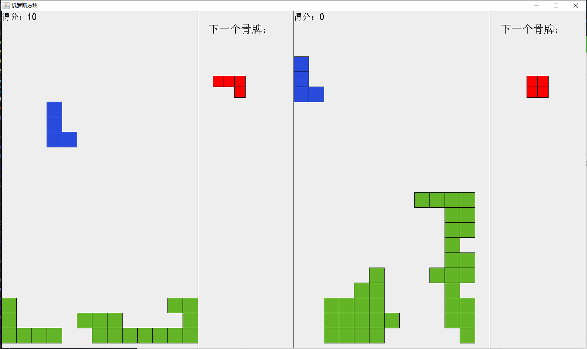

# Tertris-Game
一个用Java编写的单文件俄罗斯方块游戏，支持以下功能:
- 双人同时游戏
- 得分统计
- 下一个方块的提示

A simple single-file Java implementation of tertris game, supporting: 
- two players play together
- scoring statistics
- hint for next tetrimino

## 游戏基本操作 Playing Game
- **左玩家**：AD键控制方块左右移动，空格键变换方块旋转. Left player uses 'A' and 'D' key to make tetrimino move left or right and uses 'space' for rotation.
- **右玩家**：左右方向键控制方块移动，回车键变换方块旋转. Right player uses 'Left' and 'Right' direction key to make tetrimino move left or right and uses'enter' for rotation.

## 得分 Score
消去一行得10分，分数累加显示在左上角的提示框内. A player can score 10 points for an eliminated line, with total points displayed in upper-left corner.
